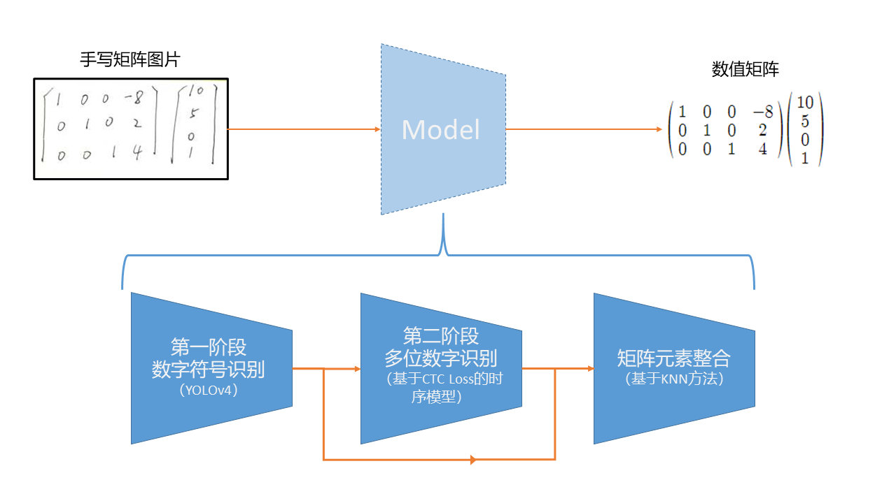

# 手写矩阵识别
# Matrix in Sights
### 黄哲昊 叶瑜超 陈禹衡

### 项目简介
我们将手写矩阵识别分为数字字符位置识别与多位手写数字识别两个阶段，并将两者的结果使用原创的基于K近邻的矩阵元素整合方法组合得到数值矩阵结果完成计算。


### 文件说明
```
Matrix_in_Sight  
├── checkpoint
|    ├── CTC:用于存放基于CTC Loss的时序网络模型参数
|    ├── mnist:用于存放一位手写数字识别网络模型参数
|    ├── YOLOv4_handwritten:用于存放识别电子版矩阵的YOLO网络模型参数
|    └── YOLOv4_Latex:用于存放识别手写矩阵的YOLO网络模型参数
|
├── data
|    ├── Latex:存放电子版矩阵识别demo
|    └── handwritten:存放手写矩阵识别demo
|
├── graph.py:基于K近邻的矩阵元素整合算法实现
├── matrix2result.py:识别图片中矩阵运算结果程序实现
├── train.py:训练YOLOv4模型
├── train_CTC.py:训练CTC Loss时序模型
└── train_mnist.py:训练mnist分类模型
```
### Environments
* Python 3.6.10
* pytorch 1.2.0
* opencv-python 3.4.0.12
* tqdm 4.31.1

### 模型下载
通过百度网盘下载checkpoint文件夹至当前目录下：
链接：https://pan.baidu.com/s/1tATB6WUHQ7fk7BhUI0xURA 
提取码：tsv6 

### 电子版矩阵demo
先将```yolov4_config.py```中```Customer_DATA```改为
```python
Customer_DATA = {
    "NUM": 7,  # dataset number
    "CLASSES": [
        "number",
        "left_matrix",
        "right_matrix",
        "add",
        "minus",
        "multi",
        "T",
    ],  # dataset class
}
```
运行以下代码输出电子版矩阵识别demo的信息
```
python matrix2result.py --model1_path=checkpoint/YOLOv4_Latex/best.pt --model2_pa
th=checkpoint/CTC/num-last.pth --gpu_id=0 --data_dir=data/Latex
```

### 手写矩阵demo
先将```yolov4_config.py```中```Customer_DATA```改为
```python
Customer_DATA = {
    "NUM": 2,  # dataset number
    "CLASSES": [
        "number",
        "T",
    ],  # dataset class
}
``` 
运行以下代码输出手写矩阵识别demo
```
python matrix2result.py --model1_path=checkpoint/YOLOv4_handwritten/best.pt --mo
del2_path=checkpoint/mnist/mnist-12-17.pth --gpu_id=0 --data_dir=data/handwritten --mnist
```

